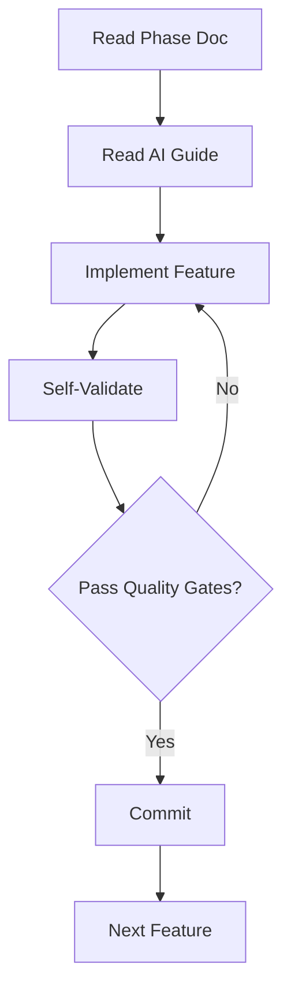

# Ayush DevFolio - Complete Documentation

> **Production-ready developer portfolio with timeline feature, CMS, and SEO optimization.**

## 📁 Documentation Structure

### Core Phase Documentation

| Phase | Document | Description |
|-------|----------|-------------|
| 1 | [Project Overview](./01-project-overview.md) | Vision, scope, tech stack |
| 2 | [Problems & Limitations](./02-problems-and-limitations.md) | Old project issues & corrections |
| 3 | [Architecture Plan](./03-architecture-plan.md) | System design & data flow |
| 4 | [Feature Specifications](./04-feature-specifications.md) | Detailed requirements |
| 5 | [Feature Breakdown](./05-feature-breakdown.md) | Component-level implementation |
| 6 | [SEO & Routing Strategy](./06-seo-routing-strategy.md) | Complete SEO guide |
| 7 | [Admin Panel](./07-admin-panel-implementation.md) | CMS implementation |
| 8 | [Implementation Roadmap](./08-implementation-roadmap.md) | Week-by-week plan |

### AI Instructions (Critical for Development)

| File | Purpose |
|------|----------|
| [Master Instructions](./instructions/00-master-ai-instructions.md) | Core principles & rules |
| [Phase 1 Guide](./instructions/01-phase1-ai-guide.md) | Project setup guidance |
| [Phase 2 Guide](./instructions/02-phase2-ai-guide.md) | Avoiding past mistakes |
| [Phase 3 Guide](./instructions/03-phase3-ai-guide.md) | Architecture decisions |
| [Phase 4 Guide](./instructions/04-phase4-ai-guide.md) | Feature implementation |
| [Phase 5 Guide](./instructions/05-phase5-ai-guide.md) | Timeline components |
| [Phase 6 Guide](./instructions/06-phase6-ai-guide.md) | SEO implementation |
| [Phase 7 Guide](./instructions/07-phase7-ai-guide.md) | Admin panel security |
| [Phase 8 Guide](./instructions/08-phase8-ai-guide.md) | Execution roadmap |
| [Code Quality Checklist](./instructions/code-quality-checklist.md) | Pre-commit checks |
| [Decision Framework](./instructions/decision-validation-framework.md) | Validation questions |
| [Common Pitfalls](./instructions/common-pitfalls.md) | What to avoid |

## 🚀 Quick Start for AI Agents

### Before Starting Development

1. **Read Master Instructions**
   ```
   docs/instructions/00-master-ai-instructions.md
   ```

2. **Review Current Phase Guide**
   ```
   docs/instructions/0X-phaseX-ai-guide.md
   ```

3. **Check Phase Documentation**
   ```
   docs/0X-phase-name.md
   ```

4. **Validate Every Decision**
   ```
   docs/instructions/decision-validation-framework.md
   ```

### Development Workflow



## 🎯 Project Overview

### What This Project Is
- ✅ Personal developer portfolio
- ✅ Content management system
- ✅ SEO-optimized web application
- ✅ Professional timeline feature

### What This Project Is NOT
- ❌ DSA practice platform
- ❌ Multi-user social platform
- ❌ E-commerce store
- ❌ Learning management system

## 🛠️ Technology Stack

- **Framework**: Next.js 14+ (App Router)
- **Language**: JavaScript (NOT TypeScript)
- **Database**: Supabase (PostgreSQL)
- **Styling**: Tailwind CSS + Shadcn UI
- **Animations**: GSAP (lazy loaded) + Framer Motion
- **Deployment**: Vercel

## 📊 Success Criteria

### Performance
- ✅ Lighthouse Score > 90
- ✅ LCP < 2.5s
- ✅ FID < 100ms
- ✅ CLS < 0.1

### SEO
- ✅ All pages indexed
- ✅ Structured data valid
- ✅ Sitemap generated
- ✅ Mobile-friendly

### Code Quality
- ✅ Zero ESLint errors
- ✅ JSDoc comments
- ✅ Error boundaries
- ✅ Accessibility compliant

## 🔒 Critical Rules

### DO ✅
- Use Server Components by default
- Add metadata to every page
- Handle all error cases
- Test on mobile first
- Validate with decision framework

### DON'T ❌
- Use TypeScript
- Skip error handling
- Import GSAP globally
- Forget admin role verification
- Ignore accessibility

## 📝 Implementation Order

1. **Week 1-2**: Foundation (Next.js, Supabase, auth)
2. **Week 3-4**: Timeline feature (components, animations)
3. **Week 5-6**: Admin panel (CRUD, forms, media)
4. **Week 7-8**: SEO & polish (metadata, optimization)

## 🤖 AI Agent Guidelines

### Before Every Feature
- [ ] Read phase documentation
- [ ] Review AI guide for that phase
- [ ] Check common pitfalls
- [ ] Validate decision framework

### During Development
- [ ] Follow code quality checklist
- [ ] Write JSDoc comments
- [ ] Handle errors properly
- [ ] Test on mobile
- [ ] Check accessibility

### Before Commit
- [ ] ESLint passes
- [ ] No console.logs
- [ ] Lighthouse > 90
- [ ] Mobile tested
- [ ] Documentation updated

## 📚 Additional Resources

- [Next.js Docs](https://nextjs.org/docs)
- [Supabase Docs](https://supabase.com/docs)
- [Tailwind CSS](https://tailwindcss.com/docs)
- [GSAP Docs](https://greensock.com/docs/)

## 🐛 Troubleshooting

### If Stuck
1. Check Space instructions first
2. Review phase documentation
3. Look at existing implementations
4. Consult AI guides
5. Ask for clarification (don't assume)

### Common Issues
- **Build fails**: Check for TypeScript files
- **Slow performance**: Check GSAP imports
- **SEO missing**: Verify metadata present
- **Admin access denied**: Check admin_access table

## 📞 Support

For questions or clarifications:
1. Review documentation thoroughly
2. Check AI instruction guides
3. Validate with decision framework
4. Seek human approval for major changes

---

**Documentation Version**: 1.0.0  
**Last Updated**: February 4, 2026  
**Status**: Complete & Approved  
**Repository**: [ayush-devfolio](https://github.com/ayushtiwari18/ayush-devfolio)